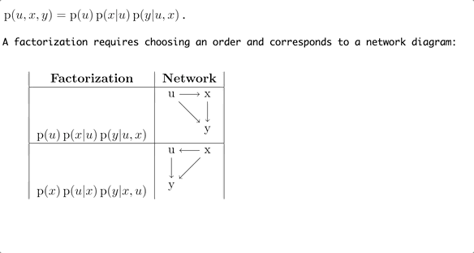

<p align="center"><a href="https://www.youtube.com/watch?v=GNS-ZFVaFM4">[6-minute video introduction]</a></p>

<table style="width:100%">
  <tr>
    <td>
      
    </td>
    <td>
      
    </td>
  </tr>
</table>

<p align="right">
  <a href="https://travis-ci.com/dandavison/xenops">
    
  </a>
</p>

   * [1. Overview](#1-overview)
   * [2. Getting started](#2-getting-started)
   * [3. How to use Xenops](#3-how-to-use-xenops)
      * [3.1 Rendering math, tables and TikZ content](#31-rendering-math-tables-and-tikz-content)
      * [3.2 Rendering all the content in the document](#32-rendering-all-the-content-in-the-document)
      * [3.3 Executing code](#33-executing-code)
         * [3.3.1 SymPy example](#331-sympy-example)
         * [3.3.2 Mathematica example](#332-mathematica-example)
      * [3.4 Working with images](#34-working-with-images)
      * [3.5 Xen mode](#35-xen-mode)
   * [4. Command and variable reference](#4-command-and-variable-reference)
   * [5. Tips](#5-tips)
   * [6. Contributing](#6-contributing)
   * [7. Credit](#7-credit)

# 1. Overview

Xenops is a LaTeX editing environment for mathematical documents in Emacs.

Please see the [6-minute video introduction](https://www.youtube.com/watch?v=GNS-ZFVaFM4).

Installation instructions are below. To use Xenops, open a `.tex` file in Emacs as usual, and do `M-x xenops-mode`. The key features are:

- **LaTeX math, tables, and TikZ diagrams are automatically displayed as SVG images in the Emacs buffer.**

  You don't need to do anything: rendering is triggered automatically. The result is that you can work on the document in Emacs without needing to frequently check the appearance of the PDF. Rendering is asynchronous, so it doesn't interrupt your writing.

- **A LaTeX file edited with Xenops is just a normal `.tex` file.**

  Other people collaborating on the same document do not have to use Xenops (or Emacs), and using Xenops does not involve adding non-LaTeX content to your `.tex` files.

- **Source code in `minted` blocks can be executed, and is syntax-highlighted.**

  Mathematica and SymPy are both capable of returning symbolic expressions as LaTeX code. This means that you can perform a symbolic calculation in a Mathematica or SymPy `minted` block, and Xenops will render the symbolic expression that results as an image of LaTeX-typeset traditional math notation.

- **Xenops provides an optional decluttered view of your document.**

  This view can be toggled on/off with `M-x xenops-xen-mode`. It works by hiding common LaTeX markup, and restyling certain document elements.

- **Images on disk are displayed in the Emacs buffer, and screenshots can be captured from the system clipboard.**

  So, for example, `\includegraphics{myfile.png}` will be displayed as an image, and if you capture a screenshot to the system clipboard, then paste (e.g. `C-y`) will prompt for a file name, save the image to disk, insert the `\includegraphics` element, and display the image.


When using Xenops, you can continue to use [auctex](https://www.gnu.org/software/auctex/): Xenops replaces the `preview-latex` functionality in auctex.

Xenops can also be used with [org-mode](https://orgmode.org) documents that contain LaTeX fragments.


# 2. Getting started

1. **Ensure that you have [LaTeX](https://www.latex-project.org/get) installed on your machine.**

    The commands `which latex` and `which dvisvgm` must both return paths to the executables. `dvisvgm` should be present as part of your LaTeX installation, but it's also available [here](https://dvisvgm.de/Downloads).

1. **Ensure that your Emacs version is at least Emacs 26.**

    This is necessary because Xenops uses [emacs-aio](https://github.com/skeeto/emacs-aio).

    If you are using MacOS, install emacs from homebrew using the `emacs-mac` package (aka Mitsuharu's Emacs build), since it uses WebKit to render SVG, resulting in beautifully crisp images.

1. **Install Xenops from [MELPA](https://github.com/melpa/melpa).**

    ```
    M-x package-refresh-contents RET
    M-x package-install RET xenops RET
    ```

    To activate Xenops, use `M-x xenops-mode` after opening a LaTeX file.

1. **Optional: activate xenops-mode automatically for LaTeX files.**

    ```emacs-lisp
    (add-hook 'latex-mode-hook #'xenops-mode)
    (add-hook 'LaTeX-mode-hook #'xenops-mode)
    ```

1.  **Run `M-x xenops-doctor`**

    You must run Emacs as a GUI application, not as a terminal application. This is because Xenops displays images in Emacs buffers.

    `M-x xenops-doctor` will check all the requirements listed above and some others. You should see this:
    <br>
    If so, move on to the next section, `"How to use Xenops"`. If not, the `xenops-doctor` output will explain what is wrong.


# 3. How to use Xenops

You don't need to learn any commands for Xenops to render your math: you just type, and Xenops will render it. The animation at the top of this README gives an idea of what this looks like (refresh the page to make it play again).

More explicitly, here are the basic steps for working with math in Xenops:

  1. **Enter some LaTeX math code, using any of the standard delimiters:**<br>`$...$`, `\(...\)`, `\[...\]`, `\tikz ...;`, `\begin{equation|align|table|tabular|tikzpicture}`.

  2. **Move the cursor out of the block: an image of the math will appear.**

  3. **Move the cursor over the image and hit Enter: the image will disappear and you can edit the LaTeX code.**

      <table style="width:100%">
        <tr>
          <td>
            
          </td>
        </tr>
      </table>

If you want Xenops to reveal the LaTeX code for editing automatically when the cursor moves into the block, set the variable `xenops-reveal-on-entry`.

You may also want to create images for all math/table/TikZ elements in the document. To do that, position the cursor outside any element and issue `xenops-dwim`.

The other command to know from the start is `xenops-doctor`: run this if something is not working.

The following sections give more detailed instructions and examples.

## 3.1 Rendering math, tables and TikZ content

This section gives step-by-step instructions and shows what to do if it is not working.

1. **Open a file containing LaTeX math content:**

    ```latex
    \documentclass{article}
    \usepackage{amsmath}
    \begin{document}
    An example equation is
    \begin{equation*}
    \frac{\partial \mathcal{L}}{\partial q} - \frac{d}{dt}\frac{\partial \mathcal{L}}{\partial \dot{q}} = 0.
    \end{equation*}
    The document continues.
    \end{document}
    ```

    Xenops recognizes the usual delimiters: `$...$`, `\(...\)`, `\[...\]`, `\tikz ...;`, `\begin{equation|align|table|tabular|tikzpicture}`.

2. **Move the cursor into a math element:**

    

3. **Move the cursor out of that element. The content in the block will shortly be replaced by an image:**

    

4. **To remove the image and continue editing, click on it or move the cursor over the image and hit Enter.**

5. **What if something went wrong?**

    There are a few things that could go wrong. For example, Emacs might not be able to find the `latex` executable on your machine, or `latex` might fail due to errors in your code.

    If something went wrong, a yellow warning triangle will appear at the beginning of the math block:
    

    To investigate what the problem is, you can hover the mouse over the triangle, or right-click on the triangle to bring up a menu. Here's what you might see if you hover the mouse over the warning triangle:
    

    So that's fairly clear: either `latex` is not installed, or Emacs is not finding the executable. Xenops has another troubleshooting tool which it would make sense to use at this point: `M-x xenops-doctor`. Here's what is displayed when we run that:

    

    Alternatively, right-click on the warning triangle brings up a menu:
    <br>
    Select `"View failing command output"` to see the errors from the `latex` process, or select `"Copy failing command"` in order to debug the problem from the command-line.


## 3.2 Rendering all the content in the document

Place the cursor anywhere in the document, but not in a math/table/TikZ element, and issue `M-x xenops-dwim`.

This will kick off one asynchronous processing task for every renderable element in the buffer whose image is not already cached. You can carry on editing the document while these are being processed. They will gradually complete, and the images will be inserted in the buffer.

Alternatively, you can select a region, and `xenops-dwim` will act on just the elements in that region.

## 3.3 Executing code

Emacs provides sophisticated facilities for executing blocks of code written in many different languages: see [org-babel](https://orgmode.org/manual/Working-with-source-code.html).

Xenops makes use of this to allow [minted](https://github.com/gpoore/minted) blocks in LaTeX buffers to be executed. Place point in a minted code block and issue `M-x xenops-dwim`:<br>
<br>
(Use `(require 'ob-python)` to enable python execution.)

There are many possibilities with documents that are a hybrid of code, code results, and traditional content: please see the [org-babel](https://orgmode.org/manual/Working-with-source-code.html) documentation.
<br><br>
With Xenops, we can use this to check calculations done by hand against the output of a symbolic algebra package.

Both [SymPy](https://www.sympy.org/en/index.html) and [Mathematica](https://www.wolfram.com/mathematica/) can return their results to the Emacs buffer as LaTeX code, and Xenops will render this immediately as an image. The result is that it feels as if Sympy/Mathematica are returning their results as an image, typeset in traditional mathematical notation, which can be helpful for a quick check of manually-obtained results:

### 3.3.1 SymPy example

```latex
\begin{minted}{python3} :sympy t :results latex
from sympy import integrate, symbols
t, y, tau = symbols('t y tau')

def picard(f, y_prev, a, b):
    return b + integrate(f.subs([(t, tau), (y, y_prev)]), (tau, a, t))

a, b = 0, 1

picard_iterates = []
y = b
for i in [1, 2, 3]:
    f = (1 - 2*t) * y
    y = picard(f, y, a, b)
    picard_iterates.append(y)

return picard_iterates
\end{minted}
```

After `xenops-dwim` on the code block, the Xenops buffer looks like this:

<table><tr><td>
  
</td></tr></table>

### 3.3.2 Mathematica example

```latex
The derivative is
\begin{align*}
  \frac{\dif}{\dif x} \frac{y'}{\sqrt{1 + y'^2}}
  &= \frac{y''\sqrt{1 + y'^2} - y'\frac{1}{2}\frac{1}{\sqrt{1 + y'^2}}2y'y''}{1 + y'^2} \\
  &= \frac{y''}{\sqrt{1 + y'^2}} - \frac{y'^2y''}{(1 + y'^2)^{3/2}}.
\end{align*}

(Check this in Mathematica):
\begin{minted}{wolfram} :results latex
D[y'[x]/Sqrt[1 + y'[x]^2], x]
\end{minted}
```

After `xenops-dwim` on the math and code blocks, the Xenops buffer looks like this:

<table><tr><td>
  
</td></tr></table>

Note that for SymPy, the header arguments `:sympy t :results latex` are necessary to tell Xenops that this is not a normal python code block and that it should insert SymPy code to automatically format the result as LaTeX. For Mathematica, `:results latex` suffices for this.

## 3.4 Working with images

The size of images displayed in the buffer can be changed with `xenops-increase-size` and `xenops-decrease-size`.

Xenops recognizes the `\includegraphics` command, and these images will be displayed by `xenops-render`. If you capture a screenshot to your system clipboard and then paste (e.g. `C-y`) into the LaTeX buffer, Xenops will notice that you're pasting image data, prompt for a file to save it in, and insert the `\includegraphics` link (implemented in MacOS only currently, see issue [#1](https://github.com/dandavison/xenops/issues/1)):

```latex
Some facts:
\begin{mdframed}
  \includegraphics[width=400pt]{xenops.png}
\end{mdframed}
The document continues.
```


## 3.5 Xen mode

The command `xenops-xen-mode` toggles an alternative cleaner view that hides common LaTeX markup and applies some visual styling. These are changes in appearance only -- the actual text content of the document is never changed and hitting save after turning on Xen mode will not cause any new changes to be written to disk.

In the example below, Xen-mode has made the following changes to the visual appearance of the document:

- `\begin{align}`, `\end{align}`, `\begin{minted}`, `\end{minted}` have been replaced with a unicode character (⚡).
- `\section` markup has been hidden and the section heading has been styled and indented according to its level.
- Some LaTeX mathematical syntax has been replaced by unicode characters.

<table>
  <tr>
    <td></td>
    <td>
      <b>Math block in edit mode</b>
    </td>
    <td>
      <b>Math block rendered</b>
    </td>
  </tr>
  <tr>
    <td>
      <b>Default view</b>
    </td>
    <td>
      
    </td>
    <td>
      
    </td>
  </tr>
  <tr>
    <td>
      <b>Xen mode</b>
    </td>
    <td>
      
    </td>
    <td>
      
    </td>
  </tr>
</table>


# 4. Command and variable reference

For commands that operate on one or more elements the rule is:
- If there is an element at the current cursor position, operate on that element.
- If there is an active selection, operate on elements in the selected region.
- Otherwise, operate on all elements in the buffer.


| Command                             |                                                                                                                                            | Default<br>keybinding                       |
|-------------------------------------|--------------------------------------------------------------------------------------------------------------------------------------------|---------------------------------------------|
| `xenops-dwim`                       | Render, Reveal, Regenerate, or Execute element(s).<br>(_do-what-i-mean_)                                                                   | `C-c !`                                     |
|                                     |                                                                                                                                            |                                             |
| `xenops-render`                     | Render element(s) as an image.                                                                                                             |                                             |
|                                     |                                                                                                                                            |                                             |
| `xenops-reveal`                     | Remove image and reveal element(s) for editing.                                                                                            | `RET` on an element,<br>click on an element |
|                                     |                                                                                                                                            |                                             |
| `xenops-regenerate`                 | Regenerate image for element(s),<br>refusing to use a cached version.                                                                      |                                             |
|                                     |                                                                                                                                            |                                             |
| `xenops-execute`                    | Execute code block.                                                                                                                        |                                             |
|                                     |                                                                                                                                            |                                             |
| `xenops-doctor`                     | Check your Emacs environment for any problems<br>that will prevent Xenops from working correctly.                                          |                                             |
|                                     |                                                                                                                                            |                                             |
| `xenops-goto-element`               | Use [avy](https://github.com/abo-abo/avy) to jump to an element.                                                                           | `C-c , g`                                   |
|                                     |                                                                                                                                            |                                             |
| `xenops-copy-and-paste-element`     | Use [avy](https://github.com/abo-abo/avy) to copy an element from elsewhere<br>and paste it at point.                                      | `C-c , c`                                   |
|                                     |                                                                                                                                            |                                             |
| `<copy>`                            | If the cursor is on a rendered element,<br>copy the entire element.                                                                        | `C-w` etc                                   |
|                                     |                                                                                                                                            |                                             |
| `<paste>`                           | If the clipboard contains an image, write the image<br>to disk and insert an `\includegraphics` link.                                      | `C-y` etc                                   |
|                                     |                                                                                                                                            |                                             |
| `xenops-show-waiting-tasks`         | Display a count of latex background processing tasks<br>that are waiting in the queue                                                      |                                             |
|                                     |                                                                                                                                            |                                             |
| `xenops-cancel-waiting-tasks`       | Cancel all latex background processing tasks<br>that are waiting in the queue                                                              |                                             |
|                                     |                                                                                                                                            |                                             |
| `xenops-increase-size`              | Increase size of image(s).                                                                                                                 |                                             |
|                                     |                                                                                                                                            |                                             |
| `xenops-decrease-size`              | Decrease size of image(s).                                                                                                                 |                                             |
|                                     |                                                                                                                                            |                                             |
| `xenops-xen-mode`                   | Toggle Xen mode on/off.                                                                                                                    | `C-c /`                                     |
|                                     |                                                                                                                                            |                                             |
| `xenops-select-font-family`         | Select a font for the Xenops buffer.                                                                                                       |                                             |
|                                     |                                                                                                                                            |                                             |
| `xenops-clear-latex-preamble-cache` | Force Xenops to recreate the latex preamble for the<br>current document. This is necessary if you have added<br>e.g. a `\usepackage` line. |                                             |
|                                     |                                                                                                                                            |                                             |
| `xenops-math-concatenate`           | Concatenate contiguous math blocks in the active region.                                                                                   |                                             |


In addition, the keybinding `C-c ,` is bound to a keymap behind which all Xenops commands are available.

<br>
<br>

| Variable                                |                                                                                                                            | Default value           |
|-----------------------------------------|----------------------------------------------------------------------------------------------------------------------------|-------------------------|
| `xenops-cache-directory`                | The location of the directory in which<br>Xenops saves SVG images.                                                         | ~/.emacs.d/xenops/cache |
|                                         |                                                                                                                            |                         |
| `xenops-font-family`                    | The font family to use in Xenops buffers.<br>(You can choose this interactively using<br>`M-x xenops-select-font-family`.) | nil                     |
|                                         |                                                                                                                            |                         |
| `xenops-font-height`                    | The font height for the main font.                                                                                         | 160                     |
|                                         |                                                                                                                            |                         |
| `xenops-font-height-code`               | The font height for the font used for LaTeX code, and code in code blocks.                                                 | 140                     |
|                                         |                                                                                                                            |                         |
| `xenops-math-image-scale-factor`        | Scaling factor for SVG math images.<br>Determines image size in the image file that is  cached on disk.                    | 1.0                     |
|                                         |                                                                                                                            |                         |
| `xenops-math-latex-max-tasks-in-flight` | The maximum number of latex<br>processing tasks that are permitted<br>to be simultaneously active.                         | 32                      |
|                                         |                                                                                                                            |                         |
| `xenops-reveal-on-entry`                | Should a math block be revealed automatically when point moves inside it?                                                  | nil                     |
|                                         |                                                                                                                            |                         |
| `xenops-tooltip-delay`                  | The time delay in seconds before<br>displaying a tooltip on mouseover.                                                     | 0.2                     |
|                                         |                                                                                                                            |                         |

<br>
<br>
When generating image previews, there are a few things one may want to configure. For example, the image type (SVG is the default, but PNG is an alternative), and details of the LaTeX document that is constructed when creating each image preview. Xenops shares these configuration mechanisms with org-mode, which also offers image preview functionality (and supports SVG). Here are the relevant org-mode variables:
<br>
<br>

| Variable                  |                                                                                                                                               | Default value   |
|---------------------------|-----------------------------------------------------------------------------------------------------------------------------------------------|-----------------|
| `org-format-latex-header` | The document header used when processing LaTeX fragments.<br>You will need to change this if you need to use <br>a different `documentclass`. | (a long string) |


# 5. Tips

- Xenops cannot currently parse `$...$` when it is broken across lines. Please try to keep them on one line for now! `fill-paragraph` (`M-q`) helps with this.

- The command `xenops-copy-and-paste-element` is very useful: when writing a mathematical document one very often wants to write an expression that is similar to something that already exists elsewhere in the document. The default binding is `C-c , c` but I recommend binding it to something more convenient: personally I am using `s-[`.

- Use `fill-paragraph` (`M-q`) while writing. In xenops-mode, in addition to its normal behavior, it ensures that all content in the paragraph is rendered.

- Xenops caches the SVG images. If it notices that it already has the image for some LaTeX math/table/TikZ content, then it will not re-run `latex`. The cache location on disk is determined by the variable `xenops-cache-directory`.

- Xenops understands the auctex variable [`TeX-master`](https://www.gnu.org/software/auctex/manual/auctex/Multifile.html). This means that you can work on multi-file LaTeX projects with Xenops: as long as `TeX-master` is set correctly, then Xenops will include the necessary LaTeX packages and preamble when it is generating images for math/table/TikZ fragments. Please see the [auctex documentation](https://www.gnu.org/software/auctex/manual/auctex/Multifile.html).

- If you are encountering any problems, the first thing to try is `M-x xenops-doctor`. Beyond that, please don't hesitate to open Github issues!


# 6. Contributing

Xenops can already be used profitably for serious work. But there are also many areas for further work. Please don't hesitate to get in touch (dandavison7@gmail.com), submit a PR, or open a Github issue.


# 7. Credit

- [auctex](https://www.gnu.org/software/auctex/)
- [emacs-aio](https://github.com/skeeto/emacs-aio)
- [org-mode](https://orgmode.org/)


<sub>Streaked Xenops (_Xenops rutilans_) image by [Dubi Shapiro](https://conservationtours.rockjumperbirding.com/dt_gallery/gallery-tours-brazils-atlantic-rainforest/streaked-xenops-by-dubi-shapiro-001).</sub>
