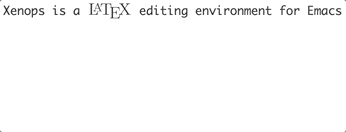

<table style="width:100%">
  <tr>
    <td>
      
    </td>
    <td>
      
    </td>
  </tr>
</table>

<p align="right">
  <a href="https://travis-ci.com/dandavison/xenops">
    
  </a>
</p>

Xenops is a LaTeX editing environment for Emacs. To use it, activate the minor mode: `M-x xenops-mode`. The key features are:

- **LaTeX math, tables, and TikZ content are automatically rendered in the Emacs buffer as SVG.**

  The result is that you can work on the document in Emacs without needing to frequently check the appearance of the PDF. Rendering is asynchronous, so it doesn't interrupt your writing.

- **A file edited with Xenops is just a normal LaTeX file.**

  Other people collaborating on the same document do not have to use Xenops (or Emacs), and using Xenops does not involve adding non-LaTeX content to your files.

- **Source code in `minted` blocks can be executed, and is syntax-highlighted.**

  Mathematica and sympy are both capable of returning symbolic expressions as LaTeX code. This means that you can perform a symbolic calculation in a mathematica or sympy `minted` block, and Xenops will render the symbolic expression that results as an SVG image.

- **Xenops provides an optional decluttered view of your document.**
  
  This view can be toggled on/off with `M-x xenops-xen-mode`. It works by hiding common LaTeX markup, and restyling certain document elements.

- **Images on disk are displayed in the Emacs buffer, and screenshots can be captured from the system clipboard.**

  So, for example, `\includegraphics{myfile.png}` will be displayed as an image, and if you capture a screenshot to the system clipboard, then paste (e.g. `C-y`) will prompt for a file name, save the image to disk, insert the `\includegraphics` element, and display the image.
  


When using Xenops, you can continue to use [auctex](https://www.gnu.org/software/auctex/): Xenops can be thought of as a replacement for the `preview-latex` functionality in auctex.

Xenops can also be used with [org-mode](https://orgmode.org) documents that contain LaTeX fragments.


# Getting started


1. **Ensure that you have [LaTeX](https://www.latex-project.org/get) installed on your machine**

    The commands `which latex` and `which dvisvgm` must both return paths to the executables. `dvisvgm` should be present as part of your LaTeX installation, but it's also available [here](https://dvisvgm.de/Downloads).
    
1. **Ensure that your Emacs version is at least Emacs 26.**

    If you are using MacOS, install emacs from homebrew using either the `emacs-plus` or `emacs-mac` packages, since they provide the required SVG support.

    Xenops can only display images if you run Emacs as a GUI application, not as a terminal application.

1. **Clone this repository.**

1.  **Load Xenops in your Emacs config file.**
    ```
    (add-to-list 'load-path "/path/to/xenops/repo")
    (require 'xenops)
    (add-hook 'latex-mode-hook #'xenops-mode)
    (add-hook 'LaTeX-mode-hook #'xenops-mode)
    ```

1. **`M-x xenops-doctor`**

    This will check all the requirements listed above and some others.
    
1. **Open a LaTeX document, and activate Xenops mode: `M-x xenops-mode`.**

    Now try entering some math using the standard delimiters, for example `$\frac{\partial L}{\partial \dot{x}}$`. When the cursor moves outside the delimiters, the math should be rendered asynchronously. If it is not, check your `*Messages*` buffer, and open a GitHub issue!

(Xenops will be submitted to MELPA soon.)


# Credit

- [emacs-aio](https://github.com/skeeto/emacs-aio)
- [auctex](https://www.gnu.org/software/auctex/)


<sub>Streaked Xenops (_Xenops rutilans_) image by [Dubi Shapiro](https://conservationtours.rockjumperbirding.com/dt_gallery/gallery-tours-brazils-atlantic-rainforest/streaked-xenops-by-dubi-shapiro-001).</sub>

